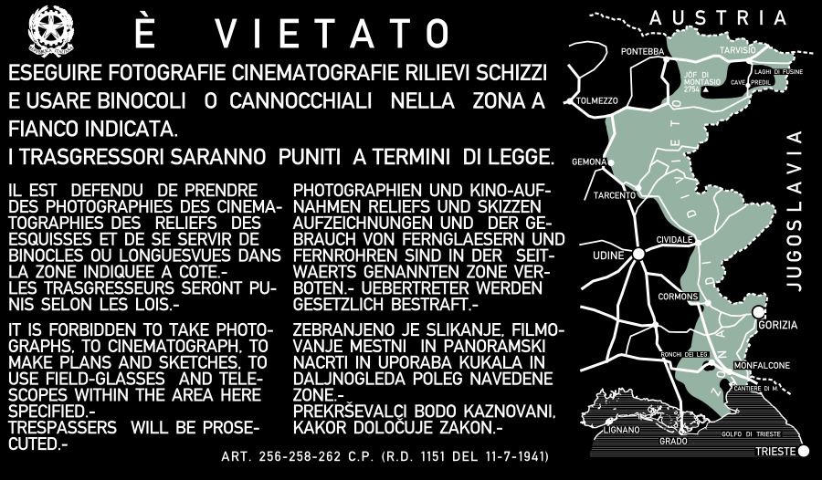
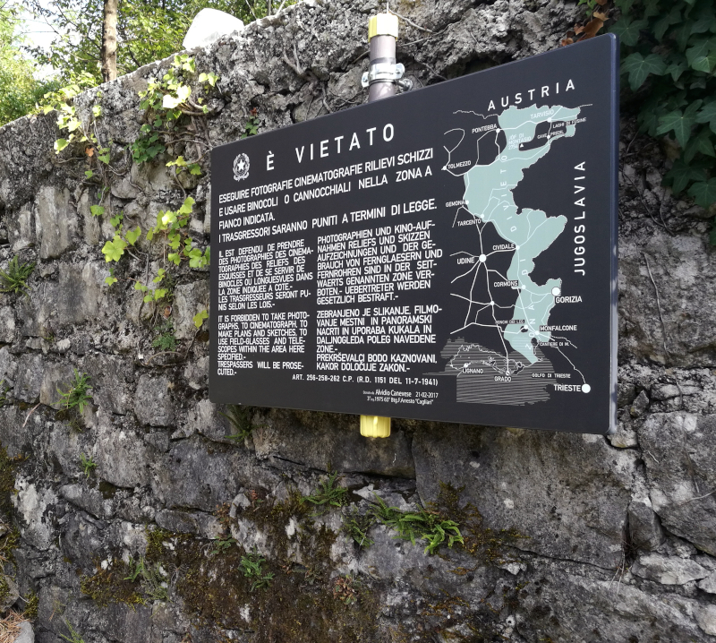

# Vectorization of a cold-war era sign, forbidding photography and survey along Italy eastern border

These four-language signs were put up by Italy in the teal coloured area, an approx. 20-30 km buffer zone along the border with Austria and the then SFR Yugoslavia (current border with the Republic of Slovenia, 1991-).

They can be tentatively dated late 40s to 50s, with slight variations. According to current knowledge, no original sign has been left standing.

This is a vectorization of the scarce photographic material available, enhanced by current geospatial data. Fidelity to the original material cannot be guaranteed (see Disclaimer).
It has been carried out in [QGIS](https://qgis.org/) and [Inkscape](https://inkscape.org/).

### Low resolution raster (to download: see *Contents* below)

### Printed and mounted in [*Bunker San Michele*](https://goo.gl/maps/dDtiNgSph5jxkdhC7)

The printed version pictured above shows a leftward shift in the sea hatching — a subtle printing artefact, unfortunately.

More details on Bunker San Michele, a restored cold-war era Italian fortification (1969-1992):

* [facebook.com/bunkersanmichele](https://www.facebook.com/bunkersanmichele)
* [bunkersanmichele.blogspot.com](http://bunkersanmichele.blogspot.com/)
* [fanteriadarresto.altervista.org](http://fanteriadarresto.altervista.org/bunkersm.html).

## Contents

**TL;DR**: download a vector pdf [here](../../releases/latest/download/photography_forbidden_FVG_converted.pdf)

* [`photography_forbidden_FVG_inkscape.svg`](./photography_forbidden_FVG_inkscape.svg) Inkscape SVG, refer to this file to re-export, convert, or edit the sign.
* [`photography_forbidden_FVG_native.svg`](./photography_forbidden_FVG_native.svg) "native SVG" converted from the Inkscape version, kept for compatibility.
* [`photography_forbidden_FVG_converted.pdf`](./photography_forbidden_FVG_converted.pdf) PDF conversion of the SVG file.
* [`photography_forbidden_FVG_raster_small.png`](./photography_forbidden_FVG_raster_small.png) low-resolution raster, for this Readme purposes.
* [`printed_and_mounted_Bunker_San_Michele.jpg`](./printed_and_mounted_Bunker_San_Michele.jpg) a picture of the printed sign, mounted on site in [*Bunker San Michele*](https://goo.gl/maps/dDtiNgSph5jxkdhC7).
* [`sign_map.qgs`](./sign_map.qgs) QGIS project (saved in version 3.14) containing the vector geographical data used in the SVG file
* [`raster_sign_georeferenced.tif`](./raster_sign_georeferenced.tif) geotiff from a picture of an original sing, trimmed to the map-only portion (CRS: EPSG:6173 - ETRS89 / UTM zone 33N)
* [`shapefiles`](./shapefiles/) directory: contains the geospatial data, cited below (see Sources)

New: _light version_, black-on-white and grayscale, more print-friendly:

* [`photography_forbidden_FVG_lightVersion_bw_inkscape.svg`](./photography_forbidden_FVG_lightVersion_bw_inkscape.svg) Inkscape SVG.
* [`photography_forbidden_FVG_lightVersion_bw_converted.pdf`](./photography_forbidden_FVG_lightVersion_bw_converted.pdf) PDF conversion of the SVG file.

## Sources

* [Emblem of the Italian Republic](https://commons.wikimedia.org/wiki/Image:Emblem_of_Italy.svg), SVG version by Wikimedia Commons user [F l a n k e r](https://commons.wikimedia.org/wiki/User:F_l_a_n_k_e_r), derived from the original of Paolo Paschetto. It is hereby used for graphical and historical accuracy to the original sign — it **does not** imply endorsement or officiality.

* Coastlines and border of Region Friuli Venezia Giulia: OpenStreetMap contributors [https://www.openstreetmap.org/](https://www.openstreetmap.org/), retrieved through the [Overpass API](https://wiki.openstreetmap.org/wiki/Overpass_API) on 2016-03-04.

* an extract of the road graph (*grafo strade*) of Region Friuli Venezia Giulia, as detailed in [geodati.gov.it](https://geodati.gov.it/resource/id/r_friuli:m10400-cc-i9981) and [IRDAT FVG](http://www.regione.fvg.it/rafvg/cms/RAFVG/ambiente-territorio/conoscere-ambiente-territorio/FOGLIA2/)

* [Alte DIN 1451](http://www.peter-wiegel.de/alteDin1451.html) font, by [Peter Wiegel](http://www.peter-wiegel.de/index.html)

## Purpose and disclaimer

This is far from a one-to-one, high fidelity reproduction of the original sign.

I have carried out this vectorization for cosmetic purposes, its intended use being printing a new sign to put in [*Bunker San Michele*](https://goo.gl/maps/dDtiNgSph5jxkdhC7).

The chosen font, a reproduction of an old version of [DIN 1451](https://en.wikipedia.org/wiki/DIN_1451), is a reasonably close match to the original.

Borders, other geographical features, translation contents were kept as close as possibile to the original sign, if not identical.
They may be outdated and are by no means authoritative, nor imply endorsement by the author.

Few pictures of the original sign can be found, e.g. the one available [here](http://fanteriadarresto.altervista.org/opere_armamenti.html) ([archived link](https://web.archive.org/web/20191224211438/http://fanteriadarresto.altervista.org/opere_armamenti.html)).

## License

[Alberto Pastorutti](https://github.com/apasto) 2016, 2020.
This work is released in the public domain, to the fullest extent permitted by applicable law, under the [Creative Commons Zero v1.0 Universal](https://creativecommons.org/publicdomain/zero/1.0/) license. See [LICENSE](./LICENSE).
